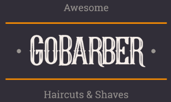
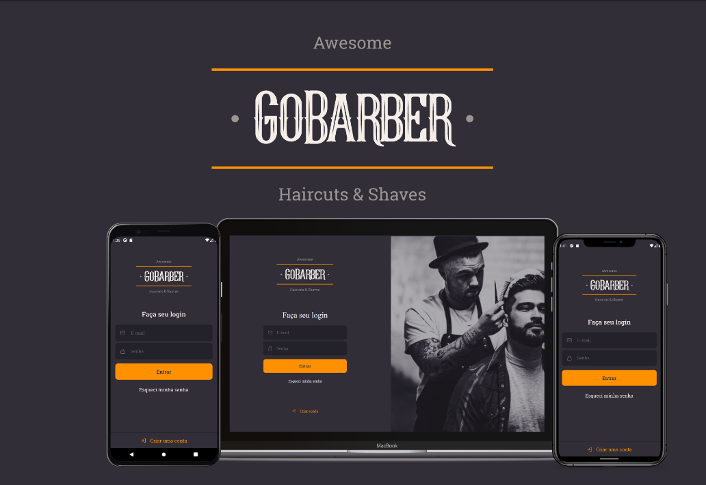
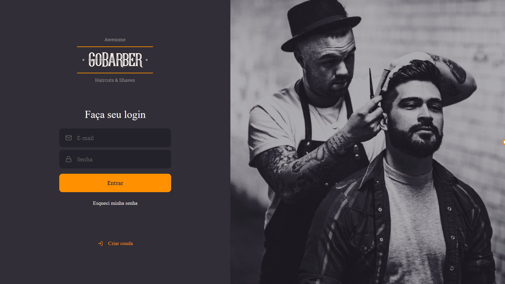
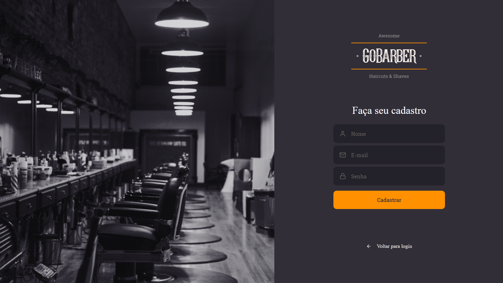
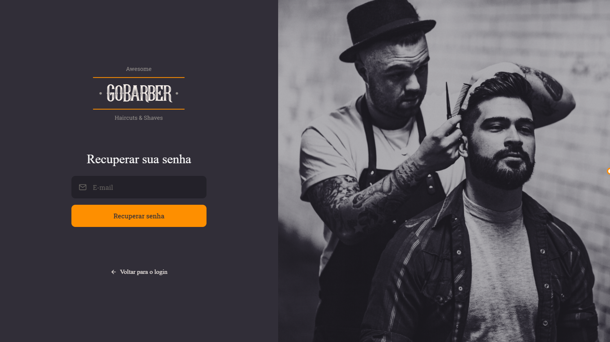
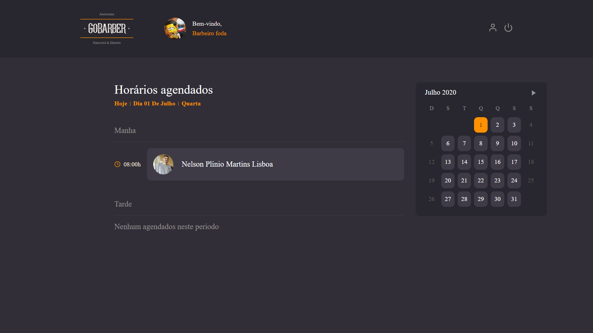
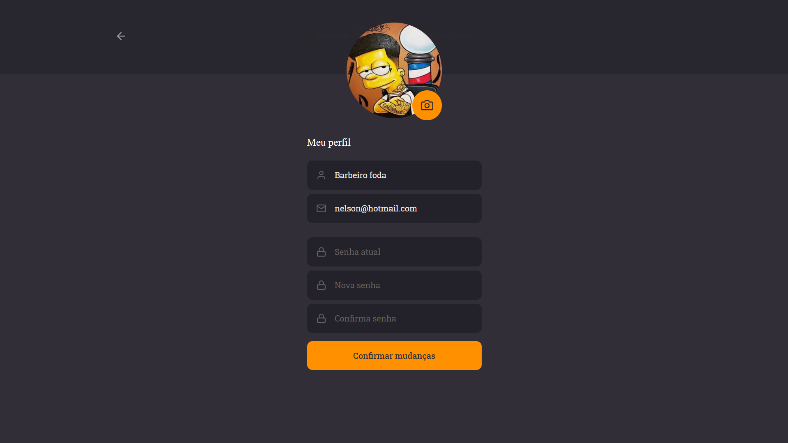

<h1 align="center">
    
</h1>

<h3 align="center">
  🪒 GoBarber 2.0 💈
</h3>

## 🔍 Sobre

Uma aplicação desenvolvida na nova jornada do GoStack, que a parte web tem como finalidade ser um painel dos prestadores de serviços da barbearia poderem ver seus agendamentos que foi feito por seus clientes. Está painel foi desenvolvido utilizando <a href="https://reactjs.org/">React JS</a> e <a href="https://www.typescriptlang.org/">TypeScript</a> com varios padrões de arquitetura de software para que o código e a estrutura de pastas fique mais facil.

## 🔗 Conjunto da obra

  -  <strong> <a href='https://github.com/nelsonplinio/GoBarber2.0-back-end'> API GoBarber  </a> </strong> - Feita em node.JS e Typescript

-  <strong> <a href='https://github.com/nelsonplinio/GoBarber2.0-mobile'> APP GoBarber  </a> </strong> - Feita em React Native e Typescript

## ⚙️ Oque foi utilizado

  - React JS
  - React hooks
  - TypeScript
  - unform
  - Axios
  - polished
  - eslint
  - prettier
  - styled-components
  - react-icons
  - react-router-dom
  - yup
  - react-day-picker

## 📷 Imagens

## 🚀 Instalar e usar

###### Clone o respostiorio.
``git@github.com:nelsonplinio/GoBarber2.0-front-end.git``

###### Instalar as dependencias.
``cd GoBarber2.0-front-end ``
`` yarn ou npm install``

###### Instalar as dependencias.
``yarn start ou npm run start ``
